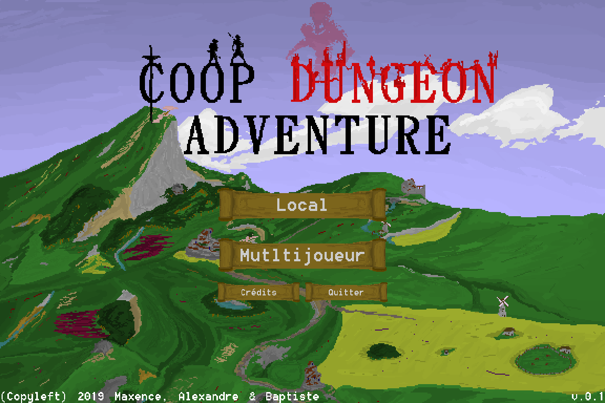
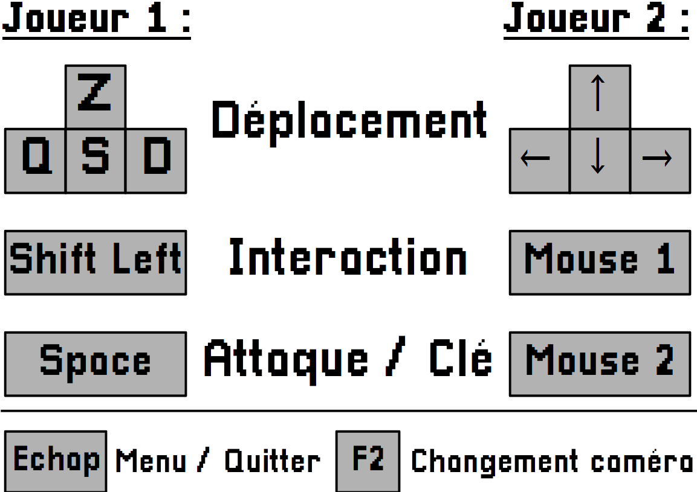

Coop Dungeon Adventure
======================
Un jeu d'énigmes/aventure coopératif initié par Maxence Bazin et Alexandre Boin dans le cadre des projets d'ISN

Installation & Lancement
------------------------
* Le jeu fonctionne sous Python 3 et nécessite certaines librairies pour fonctionner.
* Afin d'installer les librairies nécessaires, lancez la commande `python -m pip install -r requirements.txt` à la racine du jeu.
* Afin de lancer le jeu, entrez simplement la commande `python start.py` dans le dossier racine du jeu.
* (Si ces commandes ne fonctionnent pas, essayez les commandes avec le préfixe `python3` au lieu de `python`) 

Commandes de jeu
----------------

Contributeurs
--------------
- Alexandre Boin ([alexboin](https://github.com/alexboin/)) 
<<contact@alexandre-boin.fr>>
- Maxence Bazin ([MightyCode](https://github.com/MightyCode/)) 
<<contact@bazin-maxence.tk>>
